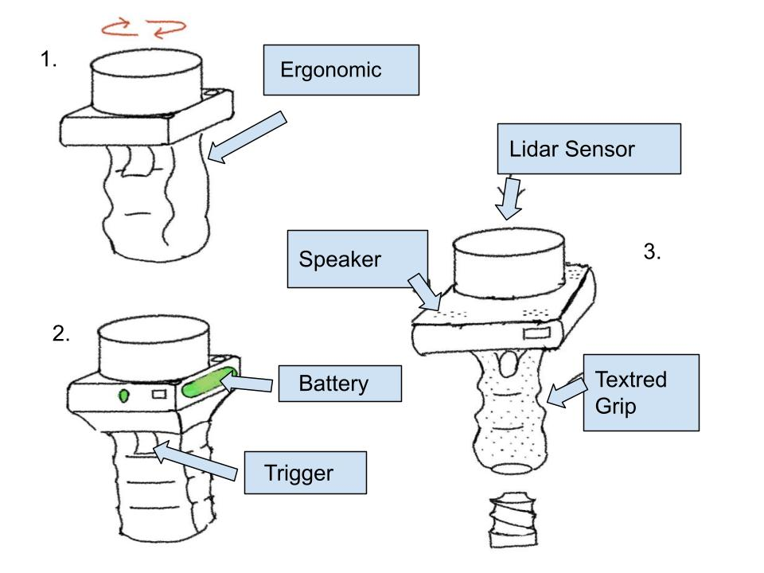
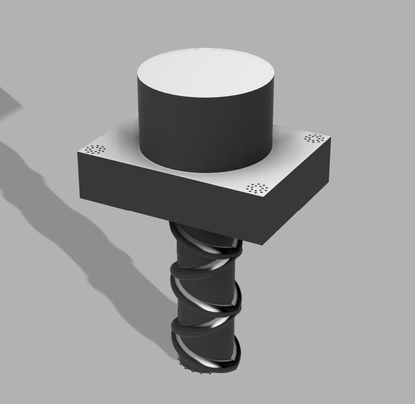

## Intro/overview

This section presents the design ideation process for **Team Phoenix Phorce's Assistive LiDAR/Sonar Navigation Device**[cite: 1]. To address key navigational challenges faced by visually impaired users—such as detecting low-lying obstacles, avoiding head-level hazards, and operating reliably in varied indoor/outdoor lighting—our team generated a wide range of modular system features[cite: 1].

Features were prioritized based on frequency, severity, and critical user needs[cite: 1], focusing heavily on **ROS2 compatibility**[cite: 1], **ambient light and solar filtering**[cite: 1], **power efficiency below 3.5W**[cite: 1], and **tactile/audio feedback mechanisms**[cite: 1].

---

## Generating Ideas

For each identified user need and product requirement, 5 distinct product features were brainstormed to satisfy the requirement (totaling 100 features).

| # | requirement / need | feature | detail |
| -: | :--- | :--- | :--- |
| **1** | Audio Notifications[cite: 1] | Variable-pitch Piezo Buzzer | Emits higher pitch tones as obstacles get closer to convey distance dynamically. |
| **2** | Audio Notifications[cite: 1] | Bone Conduction Headphone Jack | Transmits audio alerts without blocking the user's ambient environmental hearing. |
| **3** | Audio Notifications[cite: 1] | Voice Alert Synthesizer | Spoken direction prompts (e.g., "Obstacle 3 feet ahead left") via TTS engine. |
| **4** | Audio Notifications[cite: 1] | Spatial 3D Audio | Panned stereo signals indicating the precise angle (left/right) of hazards. |
| **5** | Audio Notifications[cite: 1] | Polyphonic Chime Generator | Distinct multi-tone chimes to differentiate low-battery from critical collision warnings. |
| **6** | Haptic Feedback | Dual ERM Vibration Motors | Left and right handle grip motors vibrating independently to signal obstacle direction. |
| **7** | Haptic Feedback | Linear Resonant Actuator (LRA) | Precise haptic pulses varying frequency based on proximity to physical barriers[cite: 1]. |
| **8** | Haptic Feedback | Solenoid Tapper | Micro solenoid providing distinct mechanical "clicks" on the user's thumb for quick alerts. |
| **9** | Haptic Feedback | Dynamic Variable-Grip Force | Active resistance feedback in the handle warning when entering narrow passages. |
| **10** | Haptic Feedback | Multi-Point Haptic Matrix | Array of 4 small vibration motors along the handle for 360-degree direction indication. |
| **11** | Power Management (< 3.5W)[cite: 1] | Solid-State ToF / Depth Sensor | Eliminates power-hungry mechanical spinning components[cite: 1]. |
| **12** | Power Management (< 3.5W)[cite: 1] | Dynamic Sensor Duty Cycling | Drops LiDAR scanning frequency from 20Hz to 5Hz when user is stationary. |
| **13** | Power Management (< 3.5W)[cite: 1] | Low-Power ARM Cortex MCU | Executes low-level sensor sampling with low quiescent current draw. |
| **14** | Power Management (< 3.5W)[cite: 1] | High-Efficiency Buck Converter | Synchronous buck regulator maximizing power conversion efficiency from battery. |
| **15** | Power Management (< 3.5W)[cite: 1] | OLED Display Auto-Dimming | Dims or shuts off onboard debug screen after 10 seconds of user inactivity. |
| **16** | Ambient Light Filtering[cite: 1] | Narrow Bandpass Optical Filter | Blocks solar infrared spectrum interference, isolating 940nm LiDAR laser pulses[cite: 1]. |
| **17** | Ambient Light Filtering[cite: 1] | Pulsed Light Differential Sampling | Subtracts ambient light levels from active laser return signals programmatically[cite: 1]. |
| **18** | Ambient Light Filtering[cite: 1] | High-Frequency Sonar Fallback | Switch to ultrasonic sensing when high direct sunlight lowers optical SNR[cite: 1]. |
| **19** | Ambient Light Filtering[cite: 1] | Auto-Gain Control (AGC) | Dynamically adjusts photodiode sensitivity depending on ambient lux levels. |
| **20** | Ambient Light Filtering[cite: 1] | Polarized Lens Coating | Eliminates glare reflections from wet or glass surfaces during outdoor use[cite: 1]. |
| **21** | ROS2 Software Compatibility[cite: 1] | Native micro-ROS Client | Directly serializes sensor data into ROS2 topics via USB/UART[cite: 1]. |
| **22** | ROS2 Software Compatibility[cite: 1] | Standard `sensor_msgs/LaserScan` | Outputs standard ROS2 point cloud array for plug-and-play navigation nodes[cite: 1]. |
| **23** | ROS2 Software Compatibility[cite: 1] | ROS2 Lifecycle Node Support | Firmware supports managed state machine transitions (Configure, Activate, Deactivate). |
| **24** | ROS2 Software Compatibility[cite: 1] | Dynamic Reconfigure Interface | Allows remotely tuning detection threshold parameters over ROS2 services. |
| **25** | ROS2 Software Compatibility[cite: 1] | TF2 Transform Publisher | Broadcasts real-time coordinate frames (`base_link` to `laser_frame`) for ROS2 TF trees. |
| **26** | Ergonomics & Grip | Contour Rubberized Handle | Ergonomic handgrip molded to minimize fatigue during long walking sessions. |
| **27** | Ergonomics & Grip | Lanyard Wrist Strap | Prevents device damage from accidental drops during operation. |
| **28** | Ergonomics & Grip | Adjustable Angled Sensor Head | Tilts sensor ±15 degrees to match varying user heights and walking angles. |
| **29** | Ergonomics & Grip | Ambidextrous Shell Design | Symmetric casing for seamless use by both left- and right-handed individuals. |
| **30** | Ergonomics & Grip | Lightweight Carbon Fiber Body | Reduces total device mass under 300g for effortless daily carry. |
| **31** | Obstacle Detection (Low Level) | Downward Sonar Transducer | Detects curbs, drop-offs, stairs, and holes in sidewalks. |
| **32** | Obstacle Detection (Low Level) | Wide-Beam Ultrasonic Sensor | Catches low-lying obstacles like fire hydrants, trash cans, and pets. |
| **33** | Obstacle Detection (Low Level) | Ground-Proximity Infrared Array | Short-range optical triangulation to detect subtle uneven pavement tiles. |
| **34** | Obstacle Detection (Low Level) | Mechanical Bumper Probe | Spring-loaded physical wire probe detecting physical contact at ground level. |
| **35** | Obstacle Detection (Low Level) | Time-of-Flight Cliff Detector | Point-laser measuring rapid increase in ground distance (detecting ledge drops). |
| **36** | Obstacle Detection (Overhead) | Upward Angled ToF Sensor | Scans for overhanging tree branches, signs, and low doorways at head level. |
| **37** | Obstacle Detection (Overhead) | Dual 2D Micro LiDAR Array | Provides vertical plane scanning to catch obstacles above waist height. |
| **38** | Obstacle Detection (Overhead) | Ultrasonic Rangefinder | Wide-cone upper transducer checking overhead clearance continuously. |
| **39** | Obstacle Detection (Overhead) | Stereo Camera Module | Processed depth map to spot hanging obstacles outside optical sensor cones. |
| **40** | Obstacle Detection (Overhead) | Parabolic Mirror Reflective ToF | Spreads single laser beam vertically to cover head-to-waist area efficiently. |
| **41** | Wireless Communication | Bluetooth Low Energy (BLE 5.0) | Streams diagnostic telemetry and status to a companion smartphone app. |
| **42** | Wireless Communication | Wi-Fi Access Point | Hosts local web-based configuration page for firmware setup and sensor calibration. |
| **43** | Wireless Communication | LoRa Remote Tracking | Transmits emergency location packets over long range in outdoor environments. |
| **44** | Wireless Communication | NFC Quick Pairing | Enables instant Bluetooth setup by tapping smartphone to handle enclosure. |
| **45** | Wireless Communication | ESP-NOW Protocol | Peer-to-peer low latency communication between main handle and secondary wearable units. |
| **46** | Power Supply & Battery | Swappable 18650 Li-Ion Battery | Allows user to replace depleted batteries instantly on long trips. |
| **47** | Power Supply & Battery | USB-C Power Delivery (PD) | Fast charging interface powering and charging device via standard chargers. |
| **48** | Power Supply & Battery | Wireless Qi Charging Pad | Solderless inductive charging receiver for easy drop-in desk docking. |
| **49** | Power Supply & Battery | Fuel Gauge IC (MAX17048) | Calculates precise state-of-charge % based on cell voltage algorithm. |
| **50** | Power Supply & Battery | Solar Trickle Charge Panel | Integrated mini solar panel extending battery life during outdoor daylight use[cite: 1]. |
| **51** | User Inputs & Controls | Tactile Multi-Function Buttons | Distinct raised physical button shapes (circle, square) for blind operation. |
| **52** | User Inputs & Controls | Rotary Mode Dial | Stepped detent dial for switching between "Indoor", "Outdoor", and "Crowded" modes. |
| **53** | User Inputs & Controls | Capacitive Touch Slider | Smoothly adjusts haptic feedback intensity or audio volume. |
| **54** | User Inputs & Controls | Mechanical Mute Switch | Physical rocker switch instantly silencing audio alarms in quiet environments. |
| **55** | User Inputs & Controls | Emergency SOS Panic Trigger | Long-press recessed button emitting loud horn alarm and requesting help via BLE. |
| **56** | Status Display | High-Contrast Mini OLED | 128x32 screen displaying IP address, ROS status, and battery percentage. |
| **57** | Status Display | Multi-Color Status LED Array | RGB LED showing system boot status, error codes, and ROS connection state. |
| **58** | Status Display | E-Paper Screen | Ultra low-power display retaining last status and QR code even when unpowered. |
| **59** | Status Display | Single Pulse Heartbeat LED | Flashes at 1Hz to signal healthy background micro-controller execution. |
| **60** | Status Display | Serial TTL UART Port | Exposed internal pin header for real-time serial terminal debugging. |
| **61** | Durability & Weatherproofing | IP65 Rubber Gaskets | Seals shell halves to prevent rain and dust entry during outdoor navigation[cite: 1]. |
| **62** | Durability & Weatherproofing | Shock-Absorbing TPU Bumpers | Overmolded rubber corners protecting electronics from 1.5m drops onto concrete. |
| **63** | Durability & Weatherproofing | Hydrophobic Lens Coating | Repels water droplets on sensor optical windows during rain showers. |
| **64** | Durability & Weatherproofing | Recessed Sensor Optics | Keeps laser lens sunken within shell to avoid scratches when laid face-down. |
| **65** | Durability & Weatherproofing | Sealed Tactile Button Caps | Silicone button covers preventing moisture ingress into internal PCB switches. |
| **66** | Thermal Protection | Internal Thermistor Circuit | Monitors internal MCU and battery temperature, shutting down on overheat. |
| **67** | Thermal Protection | Resettable PTC Fuse | Automatic overcurrent protection guarding circuit components against short circuits. |
| **68** | Thermal Protection | TVS Surge Diodes | Suppresses ESD voltage spikes on exposed USB-C and debug ports. |
| **69** | Thermal Protection | Reverse Polarity Guard MOSFET | Prevents circuit destruction if battery is inserted backwards. |
| **70** | Thermal Protection | Passive Aluminum Heatsink | Dissipates processor heat without requiring loud, power-draining cooling fans. |
| **71** | Orientation Tracking | 6-Axis IMU (MPU6050) | Tracks device pitch and roll angles to compensate for hand movement variations. |
| **72** | Orientation Tracking | 9-Axis Magnetometer (BNO055) | Integrates compass heading to orient map navigation data relative to North. |
| **73** | Orientation Tracking | Optical Flow Camera | Mounts underneath handle to assist in dead-reckoning movement calculation. |
| **74** | Orientation Tracking | Barometric Pressure Sensor | Detects elevation changes to recognize when user is going up/down stairs or ramps. |
| **75** | Orientation Tracking | Extended Kalman Filter (EKF) | Firmware filtering merging IMU and LiDAR data for smooth position tracking. |
| **76** | Data Logging | MicroSD Card Slot | Logs raw distance data, timestamped warnings, and system logs for review. |
| **77** | Data Logging | Non-Volatile FRAM Memory | Stores user preferences and calibration offsets without flash wearing out. |
| **78** | Data Logging | Crash Flash Dump Partition | Automatically saves stack dump code to internal SPI flash during hardware faults. |
| **79** | Data Logging | Auto Diagnostic Boot Test | Runs automated self-check on sensor lines, audio output, and haptics on startup. |
| **80** | Data Logging | Web Telemetry Streaming | Streams real-time sensor distance histograms over WebSocket to browser UI. |
| **81** | Firmware Management | Dual-Bank OTA Web Flasher | Updates device firmware wirelessly without needing physical cable connection. |
| **82** | Firmware Management | Hardware Watchdog Timer | Resets microcontroller automatically if main loop freezes or enters infinite loop. |
| **83** | Firmware Management | USB Bootloader | Flashes micro-ROS code via standard USB CDC connection using Arduino/PlatformIO. |
| **84** | Firmware Management | Fail-Safe Rollback Partition | Reverts to factory default firmware if newly flashed update fails to boot. |
| **85** | Firmware Management | Cryptographic Signature Check | Verifies signed binary files before applying updates to protect device integrity. |
| **86** | Spatial Mapping & SLAM | 2D Point Cloud Generator | Converts distance measurements into 2D occupancy grid maps for ROS2 Nav2. |
| **87** | Spatial Mapping & SLAM | Dynamic Filtering Algorithm | Ignores temporary dynamic obstacles (e.g., passing insects or leaves). |
| **88** | Spatial Mapping & SLAM | Corner & Doorway Recognition | Software feature identifying geometry signature of doorways and hallway corners. |
| **89** | Spatial Mapping & SLAM | Reflective Tape Marker Sensing | Identifies high-intensity returns from reflective safety clothing or path markers. |
| **90** | Spatial Mapping & SLAM | Multi-Sensor Fusion Engine | Blends sonar range cone data with LiDAR single-line vectors into a unified depth map. |
| **91** | Customizability & Mounting | Quick-Release Cane Mount | Clamps device onto standard white cane for hybrid tactile-optical navigation. |
| **92** | Customizability & Mounting | 1/4"-20 Tripod Thread | Standard threaded mount at base for laboratory mounting and benchmarking tests. |
| **93** | Customizability & Mounting | Modular Sensor Head Clip | Snap-on housing allowing easy swap of 30-degree vs 90-degree lens configurations. |
| **94** | Customizability & Mounting | Belt-Clip Enclosure Bracket | Allows user to wear unit on belt when using external wired headset. |
| **95** | Customizability & Mounting | Magnetic Docking Plate | Neodymium magnetic mounting interface for snapping onto backpacks or chest rigs. |
| **96** | Safety & Fail-Safes | Low-Battery Auto-Vibration | Emits continuous distinct vibration pattern when battery level drops under 10%. |
| **97** | Safety & Fail-Safes | Sensor Loss Alarm | Immediately emits distinct warning beep if primary LiDAR or sonar stops communicating. |
| **98** | Safety & Fail-Safes | Redundant Dual-Sonar Array | Backup sonar transducer providing basic proximity sensing if LiDAR optical window is covered. |
| **99** | Safety & Fail-Safes | Inactivity Auto Shutdown | Powers off system after 15 minutes of zero motion detection to preserve battery life. |
| **100** | Safety & Fail-Safes | Out-of-Range Audio Signal | Soft warning tone indicating target distance exceeds max effective range (e.g., > 6 meters). |

---

## Step Three

### Sorting and Grouping

After completing the initial brainstorm of 100 features, the team sorted the ideas into functional groups. Grouping the features made it easier to compare ideas that solve similar problems and identify which features would contribute the most to the final product.

The features were organized into the following groups:

| Functional Group | Feature Numbers |
| :--- | :--- |
| **Obstacle Detection & Environmental Sensing** | 11, 16–20, 31–40, 86–90, 98 |
| **User Feedback & Interaction** | 1–10, 51–55, 96–97, 100 |
| **Processing, ROS2 & Orientation** | 13, 21–25, 71–75 |
| **Power System & Efficiency** | 12, 14–15, 46–50, 99 |
| **Physical Design, Mounting & Ergonomics** | 26–30, 61–65, 91–95 |
| **Communication & System Status** | 41–45, 56–60 |
| **Reliability, Diagnostics & Protection** | 66–70, 76–85 |

### Prioritization & Quantitative Strategy

After grouping the features, the team evaluated the ideas using five major criteria: **Reliability**, **Cost**, **ROS2 Compatibility**, **Durability**, and **Ease-of-Use**.

Each feature was rated from **1 to 5**, where 1 represents poor performance in that category and 5 represents excellent performance. The criteria were weighted based on their importance to the assistive navigation device.

| Criterion | Weight | Reason |
| :--- | :---: | :--- |
| **Reliability** | 30% | The system must consistently detect hazards and provide dependable feedback to the user. |
| **Ease-of-Use** | 25% | The device should be intuitive and require minimal interaction while walking. |
| **ROS2 Compatibility** | 20% | Features should integrate effectively with the ROS2-based architecture of the project. |
| **Cost** | 15% | Components and features should remain practical within the project budget. |
| **Durability** | 10% | The device should tolerate everyday handling and outdoor use. |

The weighted score for each feature was calculated using:

**Weighted Score = (Reliability × 0.30) + (Ease-of-Use × 0.25) + (ROS2 Compatibility × 0.20) + (Cost × 0.15) + (Durability × 0.10)**

The maximum possible score was **5.00**.

### Ranking and Discussion

Rather than selecting features only because they were technically advanced, the team considered how directly each feature addressed the primary needs of the user. Features related to obstacle detection, dependable user feedback, and system reliability generally received higher priority because they directly affect the core purpose of the device.

For obstacle detection, the team favored using complementary sensors rather than relying on a single sensing method. Features such as the **Downward Sonar Transducer (#31)** and **Time-of-Flight Cliff Detector (#35)** provide methods for detecting low-level hazards and changes in ground height, while the **Upward Angled ToF Sensor (#36)** and **Dual 2D Micro LiDAR Array (#37)** address obstacles at or above the user's upper body. The **Multi-Sensor Fusion Engine (#90)** was also ranked highly because it allows information from sonar and LiDAR sensors to be combined.

For user feedback, the team prioritized feedback that can communicate information without interfering with the user's awareness of the surrounding environment. The **Dual ERM Vibration Motors (#6)**, **Linear Resonant Actuator (#7)**, and **Bone Conduction Headphone Jack (#2)** were therefore considered strong options. Physical controls such as **Tactile Multi-Function Buttons (#51)** were also favored because they can be identified through touch.

ROS2 integration was another important consideration. The **Native micro-ROS Client (#21)**, **Standard sensor_msgs/LaserScan output (#22)**, and **TF2 Transform Publisher (#25)** provide a direct path for integrating sensor information with the required ROS2 environment. Orientation features such as the **6-Axis IMU (#71)** and **Extended Kalman Filter (#75)** could further improve the interpretation of sensor measurements while the device moves.

Power and reliability features were also considered essential. **Dynamic Sensor Duty Cycling (#12)** can reduce unnecessary power consumption, while **USB-C Power Delivery (#47)** provides a convenient charging method. Safety features such as the **Sensor Loss Alarm (#97)** and **Low-Battery Auto-Vibration (#96)** provide the user with immediate feedback when the system can no longer operate normally.

Some features were considered useful but received lower priority because they did not directly contribute to the primary navigation function or added additional cost, power consumption, or complexity. Examples include the **Solar Trickle Charge Panel (#50)**, **LoRa Remote Tracking (#43)**, **Wireless Qi Charging (#48)**, and **E-Paper Screen (#58)**. These ideas were retained for possible future iterations rather than removed from consideration.

### Refinement of Ideas

The sorting and ranking process also led the team to combine several individual ideas into more complete subsystems. For example, the original LiDAR, sonar, and orientation features can be combined with the **Multi-Sensor Fusion Engine (#90)** to create a sensing subsystem capable of detecting hazards at multiple heights while accounting for the orientation of the device.

Similarly, individual haptic and audio concepts can be combined into a multimodal feedback system. Directional vibration could provide immediate obstacle information, while audio could communicate system conditions such as sensor failures or low battery levels.

These combinations helped move the brainstorming process from individual features toward complete product concepts.

### Product Concept Groups

Following the ranking and discussion process, the selected features were divided into three preliminary product concepts. Some features appear in more than one concept because they address fundamental requirements of the system, while each concept emphasizes a different design approach.

| Concept | Design Focus | Example Features |
| :--- | :--- | :--- |
| **Concept 1 – Cane-Integrated Navigation System** | Balanced system integrated directly with a traditional white cane | #31 Downward Sonar, #36 Upward ToF, #90 Sensor Fusion, #6 Dual Haptics, #21 micro-ROS, #47 USB-C, #71 IMU, #91 Quick-Release Cane Mount, #97 Sensor Loss Alarm |
| **Concept 2 – Advanced LiDAR Navigation System** | Higher sensor capability with greater emphasis on mapping and ROS2 processing | #37 Dual 2D LiDAR, #86 Point Cloud Generator, #90 Sensor Fusion, #71 IMU, #75 EKF, #21 micro-ROS, #22 LaserScan, #25 TF2, #4 Spatial Audio, #76 MicroSD Logging |
| **Concept 3 – Lightweight Everyday Navigation Aid** | Lower-complexity design emphasizing portability, power efficiency, and ease of use | #32 Wide-Beam Ultrasonic, #36 Upward ToF, #6 Dual Haptics, #1 Piezo Buzzer, #51 Tactile Buttons, #12 Sensor Duty Cycling, #13 Low-Power MCU, #46 Swappable Battery, #61 IP65 Gaskets, #62 TPU Bumpers |

These three groups will be developed further into the three visual product concepts in the next step.

## Step Four

These are the 3 Concept Designs we have created 

## Step Six (video link)
Embedded a YouTube video that covers the 
